# Reflective Report – Student Quiz Application
## Introduction
This report reflects on the development of the Student Quiz App that was built using Kotlin and Jetpack Compose for Android. The purpose of this application is to allow users to select a topic from a list, complete a 10 multiple-choice quiz question, one at a time, and then see a summary of the results at the end. I also implemented both extension features – a colour coded question review on the summary screen, and also a full history detailed system utilizing ROOM database that lets user revisit any past quiz attempts.
To give this app a modern look, I used light blue colored theme. It  improved readability and easy navigation to the whole application. Moreover it felt refined, professional and smoother to use. The application was developed incrementally, starting with the core minimum requirements and then building up to the extension features. This made the project a useful exercise to android development, state management, and UI/UX thinking. 
## OVERVIEW
The application is built around a straightforward quiz flow. It includes five screens in total:
1.	**Home Screen** - It displays a scrollable list of available topics.
2.	**Quiz Screen** - It shows one question at a time with four answer options.
3.	**Summary Screen** - It shows the final score and a colour coded review of all answers.
4.	**History Screen** - It lists all past quiz attempts with a topic filter. 
5.	**History Detail Screen** - It shows the colour coded question review for a selected attempt.
The Questions are loaded from JSON files stored in the assets folder, one file per topic. Each quiz randomly selects and presents ten questions from the available pool of questions. The application utilizes ROOM database so the history remains available even after the application is closed and reopened.

## DEVELOPMENT APPROACH
The application was built in stages rather than trying to do everything at once. Stages was committed to version control separately. It made things easy to track what was done and was easier to go back if something crashes.
### Stage 1 – Minimum Requirements
The first stage focused on getting the core quiz working. This stage focused on setting up navigation, loading questions from JSON, displaying one question at a time, tracking the score, and navigating to a summary screen when the quiz finished. The main challenge was to get the state transitions right, I needed to make suer the user could not re-answer a question or skip ahead accidentally.
### Stage 2 – Extension 1: Question Review
Once the quiz was working, I added the color coded question review to the summary screen. This required changing the state model in the ViewModel because the app now had to remember every answer the user gave, not just the final score. This taught me that adding new features often means rethinking the data model and not just adding a new screen.
### Stage 3 – Extension 2: History with ROOM
The final stage was implementing the full history feature. This involved building the entire database layer from scratch, the Entity, DAO, database class and Repository , connecting it to a ViewModel and two new screens. I also added a filter feature so that the user can filter the history by topic. 

## Technical Implementation
### Styles and Themes 
For the Styles and Themes, I utilized Material Design 3 as the foundation to build upon. It provided a consistent color scheme and component styling for every screen. Dynamic color was disabled so that the app always looks the same regardless of the device’s system setting. 
Color was also used meaningfully to give the user instant feedback. Answer fields animate to green when correct and red when wrong using ‘animateColorAsState’:
 
 
Additionally the score on the summary and history screens also changes colour based on performance, for instance green for 80% or above, amber for 50% or above, and red below that.
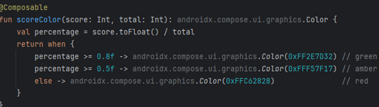

### Lazy Lists
I used ‘LazyColumn’ across multiple screens instead of using a regular ‘Column’. The difference between them is that ‘LazyColumn’ only renders items that are currently visible on screen, while ‘Column’ renders everything at once. It is very important for the performance, especially on the history and summary screens, where lists of questions or past attempts can be long.
On the home screen, the topic list uses ‘LazyColumn’.
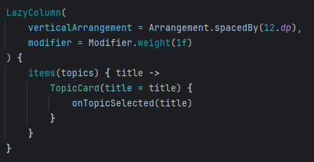

On the summary and history detail screens, ‘itemsIndexed’ is used so each card knows it question number.
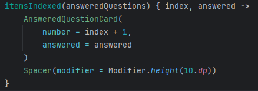

Additionally, LazyRow was used for the topic filter chips that allows the user to scroll horizontally through the available topic filters without them taking up too much vertical space.
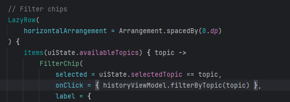

### BackStack Management
I paid careful attention to navigation back stack. Managing it properly was very important to make sure the app felt natural to the user. When a quiz is completed, ‘popUpTo(NavRoutes.Home)’ is used so that it removes the quiz screen from the back stack, this means if the user presses the back button on the summary screen , they go straight back to the home screen rather than back into the middle of the quiz they have already completed.
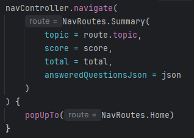
 
The restart button on the summary screen also uses careful back stack handling.  Also for other screens, ‘popBackStack()’ is used consistently for the back button to return to the previous screen as expected.
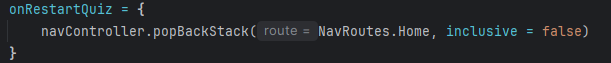

### NavHost
To handle the navigation across screens, a ‘NavHost’ was set up inside a single ‘AppNavigation’ composable in ‘MainActivity’. For defining routes, type-safe route objects were used instead of using the older string-based approach.
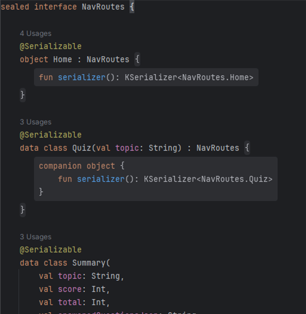

The main advantage of this approach is that it is checked at compile time. With string based routes a typo would compile fine but crash at runtime. With type-safe routes, that kind of mistake is caught immediately before the app even builds.
The quiz app in total has five screens, Home, Quiz, Summary, History and History Detail, all of them are defined and connected in one place, making it easy to follow the flow of the app.
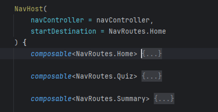

### ViewModel
There are three ViewModels that are created to separate the state management responsibilities across the app. ‘QuizViewModel’ handles everything related to the quiz. It holds the list of questions, It keeps track of the current question, the selected answer, the user’s score, and the list of answered questions. It extends ‘AndroidViewModel’ to access the application context for reading JSON files from assets and connecting to the database.
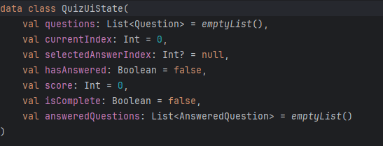
 
‘HistoryViewModel’ loads past quiz results from the database and handles the topic filtering. ‘HistoryDetailViewModel’ is responsible for loading a single quiz result when the user taps on a history entry. All three expose their state as ‘StateFlow’, which is read-only from the UI.
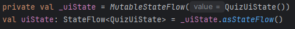

In the UI, ‘collectAsState()’ is used to observe the state so the screen recomposes automatically whenever something changes.
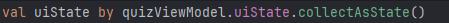
 
One important fix I made during testing was preventing the quiz from resetting on device rotation. Even though the ViewModel survives configuration changes, ‘LaunchedEffect’ was calling ‘loadQuestions’ every time the screen reappeared. I fixed this with a simple guard.
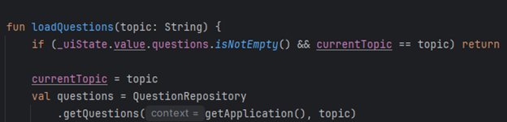
 
After this fix, rotating the device no longer resets the quiz.

### Serialization
I used the ‘kotlinx.serialization’ library in two different ways. The first time was for navigation routes. Each route is marked with @Serializable so that data like the topic name or score can be passed between screens safely and in a type-safe way.
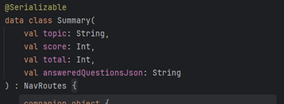
 
The second was for storing the answered questions. Rather than creating a whole separate database table for individual answers, I serialized the whole list meaning the list of answered questions is converted into a JSON string when saving and converted back into a list when reading. It keeps the database simple while still storing everything that is needed.
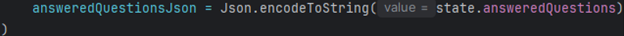
 
The ‘AnsweredQuestion’ data class is also marked with ‘@Serializable’ to make it work.
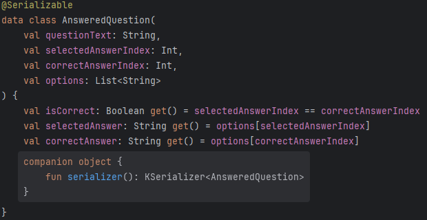
 
### Flow and StateFlow
I used ‘Flow’ in the DAO layer to return live database queries, meaning any changes to the quiz results are automatically picked up without needing to manually refresh anything. When a new quiz result is saved, the history screen updates on its own because it is observing a Flow from the DAO.
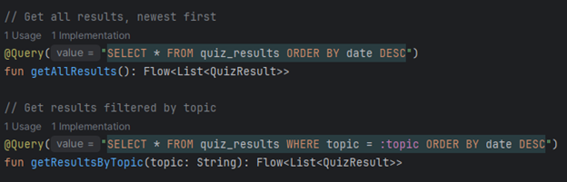
 
Inside the ViewModels, the data is exposed to the UI as ‘StateFlow’, it always holds the latest value and works well with Jetpack Compose.
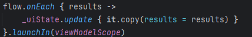
 
The difference between the two is worth noting. ‘Flow; is a cold stream, it only activates when someone collects it. ‘StateFlow’ is a hot stream that always holds a current value making it ideal for UI state because the UI can always read the latest value immediately when it appears on screen.

### ROOM Database
ROOM was used to save quiz results so they persist between sessions. The database is built from four parts, the Entity, DAO, Database class and Repository. The database has a single table based on the QuizResult entity, which stores the topic, score, total questions, the date the quiz was taken, and the answered questions as a JSON string.
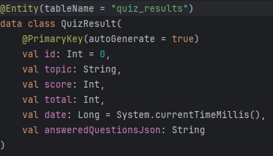

The DAO defines all the queries needed, it inserts new results, gets all results ordered by date, filters by topic, and fetches them in a single result by ID. Using ‘Flow’ as the return type for list queries means the UI updates automatically when new data is inserted.
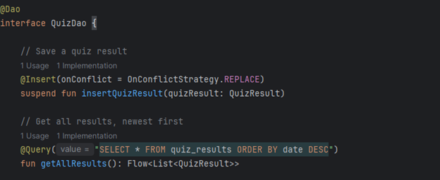 
 
The ‘QuizDatabase’ is set up as a thread-safe singleton so only one instance is ever created. Additionally, the ‘QuizRepository’ sits between the DAO and the ViewModels, which keeps the code organized and follows the recommended Android architecture pattern. Quiz results are saved automatically when the last questions is answered, using ‘viewModelScope.launch’ to keep the database operation off the main thread.
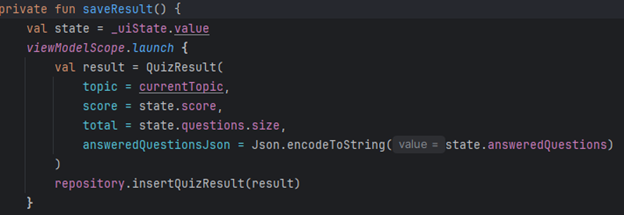 

## Challenges Faced
### Passing Complex Data Through Navigation
The issue I ran into was passing the list of answered questions to the summary screen through navigation. Navigation arguments do not support complex objects like lists directly, so I serialized the list into a JSON string before navigating and deserialised it at the destination. This kept the solution clean without needing a shared ViewModel or extra database table.
### Quiz Resetting on Device Rotation
Another challenge was during testing, I discovered that rotating the device was resetting the quiz back to question one. The ViewModel itself survived the rotation, but ‘LaunchedEffect’ was calling ‘loadQuestions’ again every time the screen reappeared. The fix was pretty simple but important, a guard at the start of ‘loadQuestions’ that returns early if questions are already loaded.

### Rethinking Architecture for Extensions
When I added the question review feature for Extension 1, I realized I could not just add a new screen. I had to go back and update the ViewModel state to record every answered question throughout the quiz, not just the end. This was a good lesson in planning the data model early, cause the extensions almost always depend on what the underlying architecture is already storing. 

## Evaluating the work
### Strengths
1.	Clean and predictable user flow from topic selection through to history review
2.	Type-safe navigation with `@Serializable` routes prevents runtime crashes 
3.	Colour coded feedback on both the summary and history detail screens
4.	ROOM database persistence that survives the app being fully closed
5.	Topic filter on the history screen for easy navigation of past attempts
### Areas for Improvement
1.	Accessibility could be improved with clearer content descriptions for screen readers
2.	The history screen currently shows all attempts in order, a search feature would be useful if the history grows large
## My Learnings
This project improved both my technical skills and my understanding of how to approach the software development more generally.
On the technical side, I learned:
1.	Kotlin and Jetpack Compose for building declarative UI
2.	Type-safe navigation using ‘NavHost’ and ‘@Serializable’ routes
3.	Managing UI state with ‘ViewModel’ and ‘StateFlow’
4.	Using ‘Flow’ for reactive database queries with ROOM
5.	Building a layered architecture with Entity, DAO, Database and Repository
   
On a broader level, I learned that following an incremental development approach is effective. The assignment as structured in stages, minimum requirements to extensions and building it that way meant each stage had a clear goal. When Extension 1 required storing answered questions in addition to the score, that change was a natural next step rather than a problem. It showed me how a well-structured minimum requirement can serve as a solid foundation that extensions can build on cleanly.Apart from that I also get to know that UI/UX really matters, it is very important to increase readability, accessibility, and to improve user experience overall.
Also, to mention AI was also useful when used critically. It helped me in structuring the code, making me understand how the code works and why it is needed, and in terms of AI It is very important to understand the code rather than actually blindly following it. Furthermore AI was used on brainstorming diverse question set for the quiz topics, ensuring a robust testing environment.Additionally I also learned that version control with meaningful commit message is genuinely useful, not just a formality. Being able to go back to a working commit when something crashes made the development process much less stressful. 

##  Conclusion
The finished application meets all the minimum requirements and both sets of extension features. Building it gave me a practical experience with the full stack of android development, from UI with Jetpack Compose, through navigation and state management to database persistence with ROOM. 
The most valuable part of the project was not any single feature, but understanding how all the pieces connect. Navigation, state, data and UI are not independent topic, they influence each other constantly, and this project made that very clear. 

## Bibliography 
- Android Developers. (2024). *Jetpack Compose overview*. Retrieved from https://developer.android.com/jetpack/compose
Android Developers. (2024). *Save data in a local database using Room*. Retrieved from https://developer.android.com/training/data-storage/room 
- Android Developers. (2024). *Kotlin flows on Android*. Retrieved from https://developer.android.com/kotlin/flow 
- Kotlin Documentation. (2024). *Serialization*. Retrieved from https://kotlinlang.org/docs/serialization.html 
 - Android Developers. (2024). *State and Jetpack Compose*. Retrieved from https://developer.android.com/develop/ui/compose/state
 - Android Developers. (2024). *Navigation with Compose*. Retrieved from https://developer.android.com/develop/ui/compose/navigation
 - Android Developers. (2024). *ViewModel overview*. Retrieved from https://developer.android.com/topic/libraries/architecture/viewmodel - 
- Google. (2024). *Material Design 3*. Retrieved from https://m3.material.io

