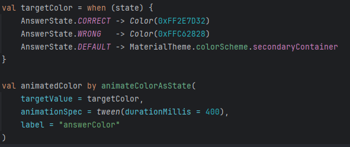

## Technical Implementation
### Styles and Themes 
For the Styles and Themes, I utilized Material Design 3 as the foundation to build upon. It provided a consistent color scheme and component styling for every screen. Dynamic color was disabled so that the app always looks the same regardless of the device’s system setting. 
Color was also used meaningfully to give the user instant feedback. Answer fields animate to green when correct and red when wrong using ‘animateColorAsState’:

